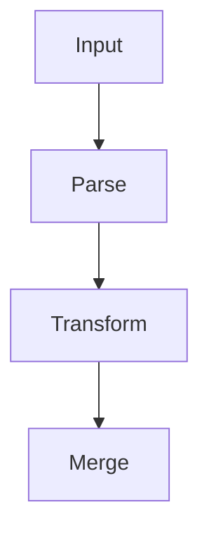

# Chaining

The chaining pattern is when you need to execute some [activities](activities.md) in a specific order.
The output of one activity is fed to the next, and so on, until a desired output is achieved.

## In regular php

In regular PHP, you'd likely write this as a job, or a collection of jobs. A proper example might be an import process:



These might be independent jobs that can be highly reused across different supported formats.

### Downsides

The failure case in these types of chaining, is how the chain is constructed.
Usually, once one job finishes, it must trigger the next job.
Ideally, you'd have some way to "orchestrate" a chain,
ensuring each step gets executed in the proper order, exactly once.

## In durable php

In Durable PHP, [orchestrations](orchestrations.md) allow you to write the flow in an imperative style:

```php
function chain(\Bottledcode\DurablePhp\OrchestrationContext $context): object {
    try {
        $input = $context->getInput();
        $result = $context->waitOne($context->callActivity('parse', [$input]));
        $result = $context->waitOne($context->callActivity('transform', [$result]));
        $result = $context->waitOne($context->callActivity('merge', [$result]));
        return $result;
    }
    catch(Throwable) {
        // handle error
    }
}
```

You can use the context parameter to invoke other functions/objects by name, pass parameters, and return the output.
Each time you call `->waitOne`, Durable PHP checkpoints your execution and unloads your code until the result is
completed.
