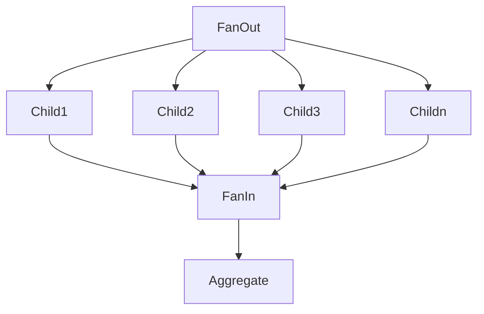

# Fanning out and in

With the fan-in-out pattern, you typically execute many tasks in parallel, wait for all the results. Typically, you
aggregate the results.



## In regular PHP

Fanning out in regular PHP is pretty straightforward. You can call another endpoint, or kick off a job. However, fanning
back in is never as straightforward. You must monitor the status of each child, handle errors, etc., and doing so
usually complicates the code, obfuscating the core logic.

## In Durable PHP

Using [orchestrations](orchestrations.md), you can fan-out and in to your heart's content, using relatively simple code:

```php
function fanOutIn(\Bottledcode\DurablePhp\OrchestrationContext $context): void {
    $tasks = [];
    for($n = 0; $n < 10; $n++) {
        $tasks[] = $context->callActivity('Child', [$n]);
    }
    
    $results = $context->waitAll($tasks);
    
    // aggregate results
}
```

In this code, a list of tasks is created to call an [activity](activities.md). The work is started immediately, and
distributed among a cohort of workers. Once we call `->waitAll()`, the orchestration is put to sleep until all tasks are
completed, at which point, execution is resumed. Errors from tasks are also available in the results array.
