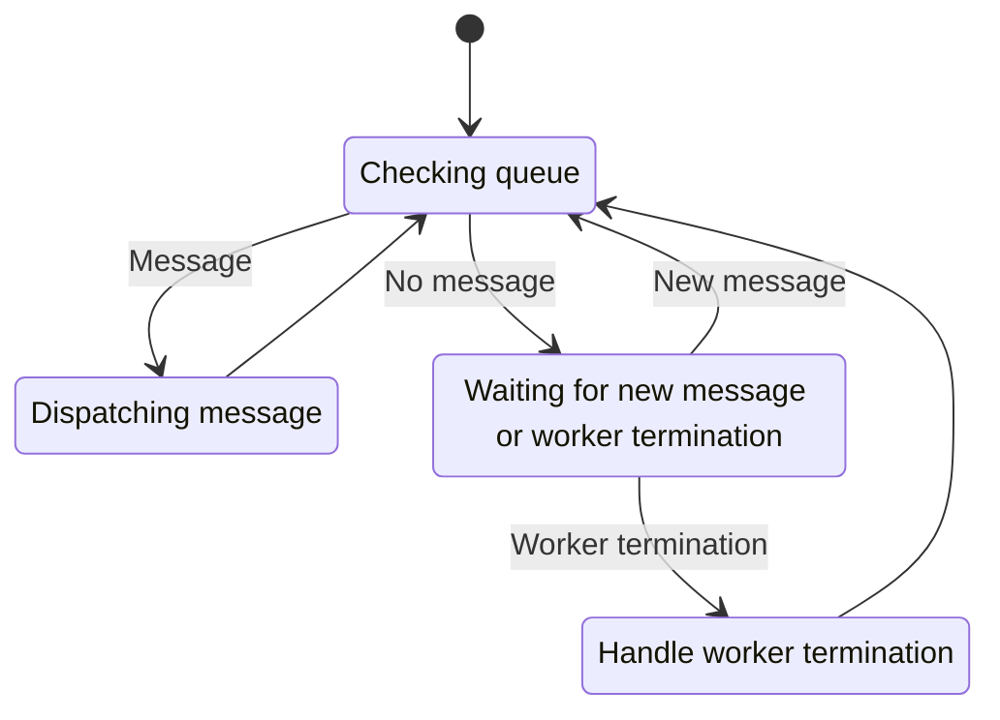
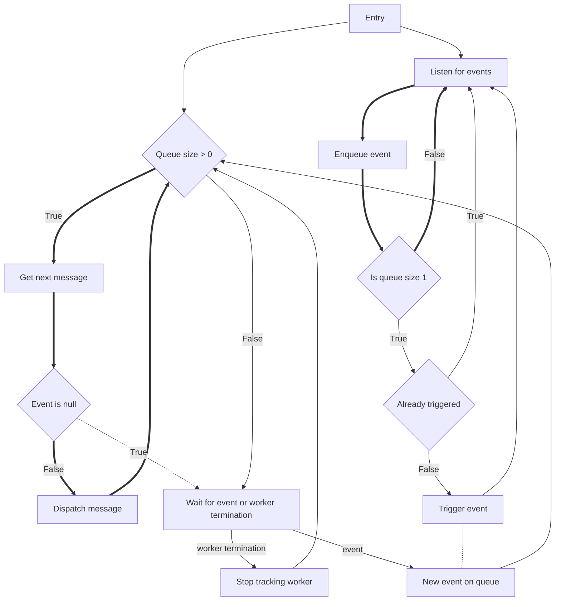

# Messages and the message pump

The library must quickly process messages from the user and the system.
This is how it works:

And a flow chart:

This will probably change as bugs are fixed upstream. (Right now, a worker can only process a single event.)
